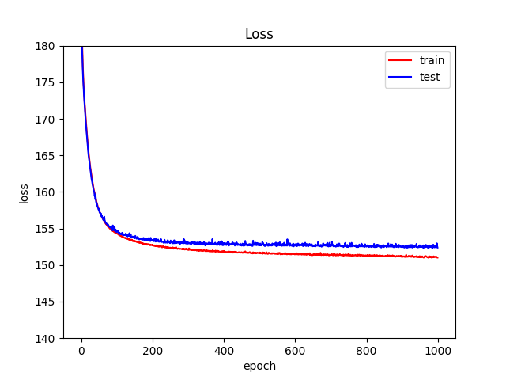
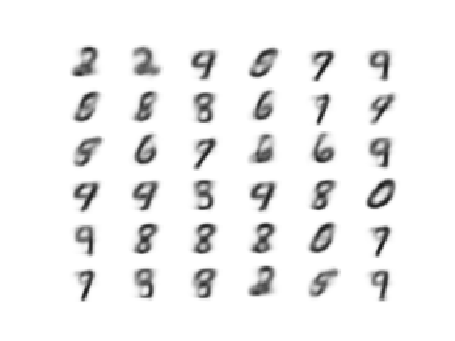
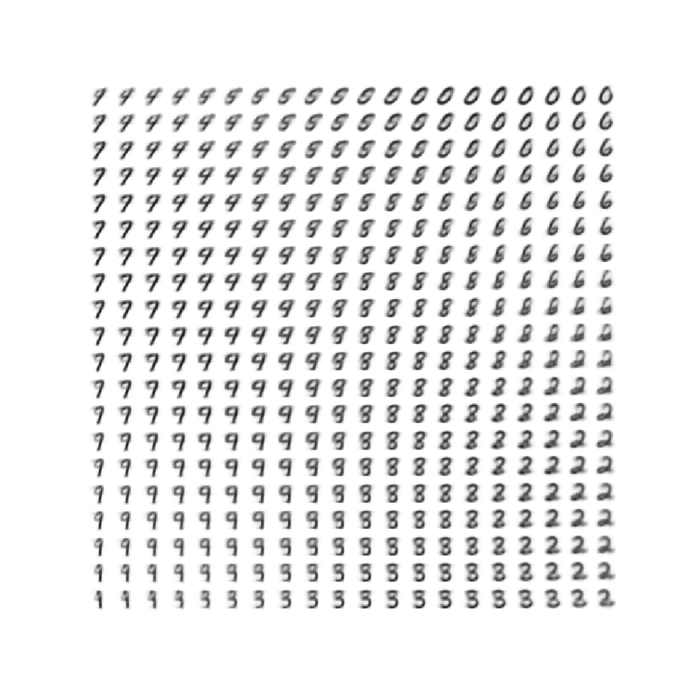

# Variational Auto-Encoder

## Description
This is an implementation of a variational auto-encoder for the MNIST dataset using PyTorch. 
The method was introduced in this [paper](https://arxiv.org/abs/1312.6114) by Kingma, Diederik P. and Max Welling.

## Results
The following figure shows the training loss and testing loss after each epoch of training.

The following figure shows the samples generated from the model.

This figure shows the generated samples in the 2D latent space.

